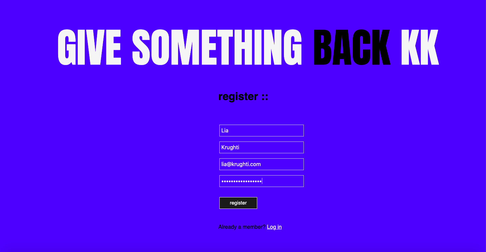

# Overview

App with React+Redux where people can create their profile, add friends and chat with other users.

# Preview

# Features

-   Create/edit profile and upload picture

-   Send/receive and accept friend requests button

-   Visit other's profiles and search for other people

-   See latest three users who joined the network.

-   Chat room to chat with other users who are currently online

# Technologies

React, React Hooks, Redux, Socket.io, AWS S3, Node.js, Express, PostgreSQL, Multer, CSS, HTML.

---

Project developed during SPICED Academy, 2019.
